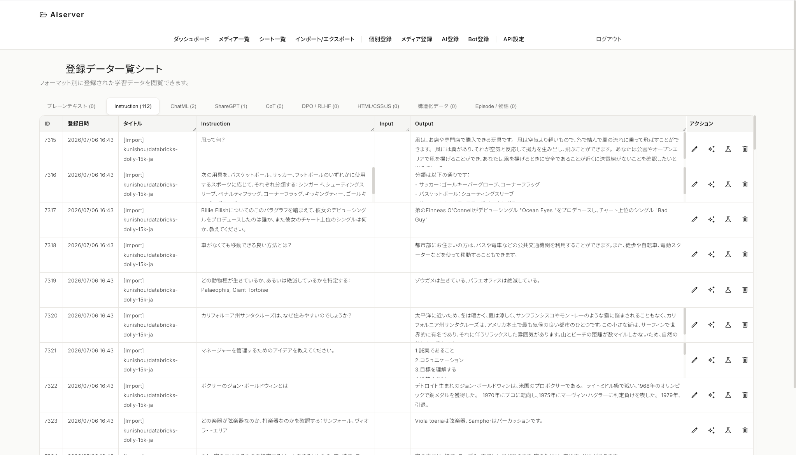

# AI Data Manager (WordPress Theme)

WordPressを「LLM（大規模言語モデル）の学習データ管理・アノテーションツール」へと進化させる、特化型のWordPressテーマです。
Sara-engine（https://github.com/matsushibadenki/sara-engine-project）に最適化されています。  
  
通常のブログやWebサイトとして公開するためのテーマではなく、クローズドな環境でデータエンジニアやAI研究者が高品質なデータセットを構築・管理するための**Webアプリケーション**として機能するように設計されています。

## 🎯 設計と思想 (Design & Philosophy)

1. **WordPressの強力なCMS機能をデータ管理に転用**
   既存のデータベース（投稿機能やメタデータ）とユーザー認証システムをそのまま活用し、テキストデータや画像データ、それらに紐づく複雑なメタデータ（JSON等）を効率的に管理します。
2. **多様なAI学習フォーマットへの対応**
   単純なプレーンテキストから、Instruction（指示・入力・出力）、ChatML、ShareGPT、Chain-of-Thought（CoT）、DPO / RLHF用フォーマット、Episode / Causal Narrative（物語・因果構造）に至るまで、様々なフォーマットでの登録・管理をサポートします。
3. **データ拡張（Augmentation）と蒸留（Distillation）の内製化**
   OpenAI、Google Gemini、およびローカル環境のLLM（Ollama, Llama.cpp等）のAPIと連携。既存のデータから自動的にバリエーションを生成したり、プレーンテキストからQ&Aペアを抽出・精製（データ蒸留）する機能を有しています。
4. **学習パイプラインとのシームレスな統合**
   ブラウザからのJSONLインポート・エクスポートはもちろん、外部のPythonスクリプトや学習フレームワーク（Axolotl等）からREST API経由で直接最新データを取得できる設計になっており、MLOpsパイプラインへの組み込みが容易です。

---

## 🚀 主な機能 (Features)

- **ダッシュボード**: 登録されたデータ数やトークン数（概算）などの統計情報をグラフで可視化します。
- **データの一覧・個別登録**: 構造化されたデータをフォーマット別にタブで一覧表示。個別画面からの入力・編集も直感的です。
- **Episode / Causal Narrative**: 物語本文、主体、目的、行動、因果関係、短期・長期結果、影響、反実仮想、抽出原則を原典JSONとして保存できます。保存したEpisodeは後からInstruction、ChatML、DPOなどへ変換しやすい構造です。
- **URLスクレイピング・自動データ生成**: Wikipediaやブログ記事などのURLを指定するだけで、自動的にWebページのテキストを抽出し、LLMを活用して指定されたフォーマット（QA形式など）の学習データを生成・一括登録します。
- **バリエーション自動生成・データ蒸留**: ボタンひとつで強力なLLMへリクエストを送り、データを高品質に書き換えたり、CoT（思考プロセス）を自動付与します。
- **連続自動蒸留**: ユーザーが停止するまで、WordPress CronでLLM生成・構造検証・重複除去・保存・再試行を自動反復します。Docker環境では常駐Cron RunnerとWatchdogが画面アクセスなしで処理を進め、ジョブの進捗、生成件数、エラー、次回実行時刻、Runnerのハートビートを画面で確認できます。
- **概念単位の品質蒸留**: 概念から質問と複数回答を生成し、関連性・回答点の充足・情報量・確信度・可読性を自動採点します。低品質回答と意味的重複を除外し、採用回答だけをKnowledge Server向けデータとして分離します。探索重視・標準・厳格・カスタムの用途別設定で、LLMを再実行せず既存回答を再評価できます。
- **概念グラフ編集**: 中心概念、知識の枝、質問数、採用回答数をグラフで確認できます。枝の名称・範囲・優先度・質問観点・有効状態を編集し、手動で新しい枝を追加できます。
- **複数LLM審査**: 同じ回答候補を2つ以上の設定済みLLMへ匿名で提示し、共通の100点基準、順位投票、合議点で比較します。モデルごとの進捗・失敗・懸念点と、全会一致・多数決・意見分割をレビュー画面で確認できます。
- **合議採用・選択的再蒸留**: 質問ごとに合議順位から優先回答を選んで一括採用できます。採用履歴と元回答を保持し、選択した質問の回答候補だけを非同期で再生成して品質評価を更新できます。
- **モデル重み・評価傾向**: 審査モデルの影響度を25〜200%で調整し、APIを再実行せず合議を再計算できます。過去履歴を含む平均点、確信度、合議一致率、採点変化をモデル別に比較できます。
- **学習価値と知識被覆**: 各回答の新規性・信頼性・被覆への寄与・重複・難易度・矛盾候補を分離して評価し、Information GainとTraining Eligibilityを保存します。被覆率が低い概念の枝、最小系譜（Source → Knowledge → Sample）、ライセンス・時間的有効性の未確認状態をレビュー画面で確認できます。
- **外部連携用 REST API**: Bearerトークン認証による安全なデータフェッチエンドポイントを備えています。
- **多言語対応**: UIは多言語対応（i18n）を前提に設計されており、言語ファイルの追加によりローカライズ可能です。

---

## 🛠 セットアップと固定ページの設定方法 (How to Setup)

本テーマは通常のWebサイトとは異なり、各機能が専用の「固定ページ（Page）」に紐付いて動作するSPA（Single Page Application）ライクな構成になっています。
インストール後、以下の手順でページを設定してください。

### 1. テーマのインストール
このリポジトリのディレクトリを、WordPressの `wp-content/themes/` フォルダに配置し、管理画面の「外観 > テーマ」から有効化してください。

### 2. 必須の固定ページの作成
管理画面の「固定ページ > 新規追加」から、以下のページを作成し、画面右側の「ページ属性 > テンプレート」からそれぞれ指定のテンプレートを選択して公開（Publish）してください。
パーマリンク（スラッグ）は推奨されるURL構造に合わせて設定してください。

| ページタイトル例 | スラッグ (URL) | 割り当てるテンプレート名 | 役割 |
|---|---|---|---|
| ダッシュボード | （任意/ホーム） | `front-page` | ホーム画面・統計表示 |
| シート一覧 | `index-text` | `Text Data Index` | テキストデータのフォーマット別一覧 |
| 画像一覧 | `index-image` | `Image Data Index` | 画像データの一覧 |
| 個別登録 | `text-based-learning` | `Text Based Learning` | テキストデータの新規登録・編集 |
| 画像登録 | `media-upload` | `Media Drag & Drop Upload` | 画像データのアノテーション付き登録 |
| インポート / エクスポート | `import-export` | `Import Export` | JSONLでの一括インポート・出力 |
| API設定 | `api-settings` | `API Settings` | 各種LLMのAPIキーやサーバーアクセス用トークンの設定 |

### 3. ホームページ（フロントページ）の割り当て
管理画面の「設定 > 表示設定」を開き、**「ホームページの表示」を「固定ページ」** に変更します。
「ホームページ:」のプルダウンから、手順2で作成した「ダッシュボード（テンプレート: `front-page`）」を選択して保存してください。

これでセットアップは完了です。サイトのトップページにアクセスすると、認証画面またはダッシュボードが表示されます。

---

## 🔐 セキュリティについて
本テーマはデータを管理するためのクローズドなツールです。サイトをインターネット上に公開する場合は、必ず以下の点にご注意ください。
- すべての機能（REST APIを含む）はログイン認証、またはAPIトークン認証によって保護されています。
- 不特定多数のユーザー登録（Subscriberの開放）はオフにしておくことを強く推奨します。
- ローカル環境（Dockerなど）での運用を主なターゲットとしています。
